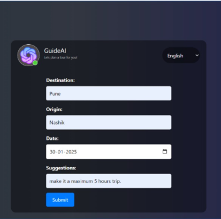

# GuideAI: AI-Powered Tourist Guide
## Overview
GuideAI is an AI-based travel assistant that helps users find locations, plan trips, get real-time navigation, and explore activities. It leverages AI for enhanced recommendations and smooth travel experiences.

## Features
✅ Live Location Tracking – Get real-time location updates.
✅ Trip Planning – AI-powered itinerary suggestions.
✅ Navigation Assistance – Find the best routes and directions.
✅ Activity Recommendations – Discover places to visit and things to do.

## Tech Stack
Backend: Flask (Python)
Frontend: HTML, CSS, JavaScript
Database: MongoDB
AI Services: IBM Watson, Google APIs
Hosting: IBM Cloud

## Installation
1. Clone the Repository
git clone https://github.com/your-username/GuideAI.git
cd GuideAI

3. Create a Virtual Environment
python -m venv venv
source venv/bin/activate  # Windows: venv\Scripts\activate

5. Install Dependencies
pip install -r requirements.txt
6. Set Up Environment Variables
Create a .env file and add your API keys:
API_KEY=your_google_api_key
IBM_WATSON_KEY=your_ibm_watson_key

5. Run the Application
python app.py
Open http://127.0.0.1:5000/ in your browser.

## Screenshots:
1. Using IBM Login Page

2. Multilingual Support

3. Using image to get information

4. Trip Planning

## Usage
Enter your current location.
Select a destination and get AI-powered suggestions.
Get real-time navigation and travel insights.

## Contributing
Feel free to fork this repository and contribute! 🚀
